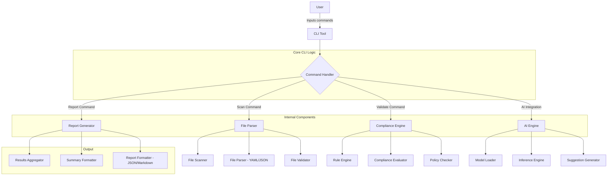

## **Architecture**  

```mermaid
graph TD
    A[User] -->|Inputs commands| B[CLI Tool]
    B --> C{Command Handler}
    C -->|Scan Command| D[File Parser]
    C -->|Validate Command| E[Compliance Engine]
    C -->|Report Command| F[Report Generator]
    C -->|AI Integration| G[AI Engine]
    
    D --> H[File Scanner]
    D --> I[File Parser - YAML/JSON]
    D --> J[File Validator]

    E --> K[Rule Engine]
    E --> L[Compliance Evaluator]
    E --> M[Policy Checker]

    G --> N[Model Loader]
    G --> O[Inference Engine]
    G --> P[Suggestion Generator]

    F --> Q[Results Aggregator]
    F --> R[Summary Formatter]
    F --> S[Report Formatter - JSON/Markdown]

    subgraph Internal Components
        D
        E
        G
        F
    end

    subgraph Core CLI Logic
        C
    end

    subgraph Output
        Q
        R
        S
    end

```