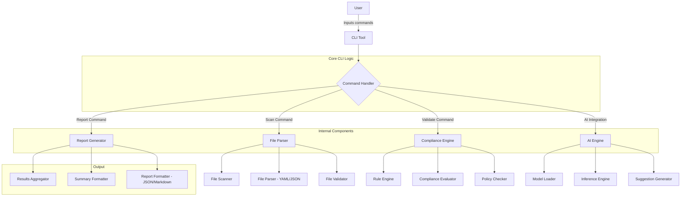

# **ScanRunner: A Modular CLI for File Validation, Compliance, and AI-Powered Insights**

## **Overview**  
**ScanRunner** is a flexible and extensible command-line tool designed to simplify file scanning, compliance checks, and AI-driven insights. Built with the powerful **Cobra** CLI framework, it enables users to process YAML/JSON files, enforce compliance rules, and leverage lightweight AI models to generate actionable suggestions.

---

## **Key Features**  

✨ **File Scanning and Validation**  
- Scan directories for YAML/JSON files.  
- Validate files for structural correctness and required fields.

📋 **Compliance Enforcement**  
- Apply customizable rules for mock compliance checks.  
- Analyze Kubernetes manifests for missing labels, RBAC misconfigurations, and more.

🤖 **AI-Powered Suggestions**  
- Leverage pre-trained lightweight AI models (ONNX) for context-aware recommendations.  
- Prioritize findings and suggest resolutions dynamically.

📈 **Reporting and Summarization**  
- Aggregate results into clean JSON/Markdown reports.  
- Generate summary statistics for compliance results and AI insights.

⚙️ **Concurrency and Scalability**  
- Process files in parallel using a worker pool.  
- Efficient resource management for large-scale tasks.

---

## **Architecture**  




---

## **Setup Instructions**  

### **Prerequisites**  
- **Go** (1.20 or later) installed.  
- Familiarity with command-line tools and YAML/JSON files.

### **Install ScanRunner**  
1. Clone the repository:
   ```bash
   git clone https://github.com/your_username/scanrunner.git
   cd scanrunner
   ```
2. Run Setup script:
   ```bash
   bash setup.sh
   ```

3. Build the tool:
   ```bash
   go build -o scanrunner main.go
   ```

---
### **Basic Commands**  

1. **Build the CLI Tool**  
   - Compile the tool before running commands:  
     ```bash
     go build -o scanrunner main.go
     ```

2. **Root Command**  
   - Display help for the root command:  
     ```bash
     ./scanrunner --help
     ```

3. **Scan Command**  
   - Run the `scan` command with default settings:  
     ```bash
     ./scanrunner scan
     ```  
   - Specify a custom directory to scan:  
     ```bash
     ./scanrunner scan --config=/path/to/config.yaml
     ```

4. **Validate Command**  
   - Run the `validate` command with default compliance rules:  
     ```bash
     ./scanrunner validate
     ```  
   - Specify a custom rules file:  
     ```bash
     ./scanrunner validate --rules=/path/to/custom-rules.yaml
     ```  
   - Specify a custom configuration file:  
     ```bash
     ./scanrunner validate --config=/path/to/config.yaml
     ```  
   - Enable strict mode:  
     ```bash
     ./scanrunner validate --strict
     ```

5. **Report Command**  
   - Generate a report in the default format (JSON):  
     ```bash
     ./scanrunner report
     ```  
   - Specify a custom output format (e.g., Markdown):  
     ```bash
     ./scanrunner report --format=markdown
     ```  
   - Save the report to a specific path:  
     ```bash
     ./scanrunner report --output=/path/to/report.md
     ```

6. **Version Command**  
   - Display the version of the CLI tool:  
     ```bash
     ./scanrunner version
     ```  
---

## **Folder Structure**  
Yes, the folder structure you provided is a great choice for your project, and the descriptions can be slightly refined for better clarity. Here's the updated explanation for your **scanRunner** folder structure:

---

### **Folder Structure Description**

```plaintext
scanrunner/
├── bin/                      # Compiled binaries (optional for pre-built releases)
├── cmd/                      # CLI commands
│   ├── root.go               # Base command setup
│   ├── scan.go               # Scan command implementation
│   ├── validate.go           # Validate command implementation
│   ├── report.go             # Report command implementation
│   ├── scan_secrets.go       # Secret scanning command (Phase 5)
│   ├── scan_dependencies.go  # Dependency scanning command (Phase 6)
│   ├── scan_iac.go           # IaC scanning command (Phase 6)
│   ├── scan_images.go        # Image scanning command (Phase 6)
│   ├── scan_code.go          # Static code analysis command (Post-MVP)
│   ├── validate_policy.go    # Kubernetes policy validation command (Post-MVP)
│   ├── scan_audit.go         # Audit log scanning command (Post-MVP)
│   ├── version.go            # Version command implementation
├── internal/
│   ├── cli/                  # CLI utilities for argument parsing and validation
│   │   ├── parser.go         # CLI argument and flag parser
│   │   ├── validator.go      # Input validation logic
│   ├── model/                # CLI utilities for argument parsing and validation
│   │   ├── rules.go          # Validation Rules Model
│   ├── compliance/           # Compliance logic and rule engine
│   │   ├── rules.go          # Compliance rules logic and handling
│   │   ├── evaluator.go      # Compliance evaluation engine
│   │   ├── report.go         # Report generation logic for compliance checks
│   ├── fileparser/           # File handling logic
│   │   ├── yaml_parser.go    # YAML file parsing and validation
│   │   ├── json_parser.go    # JSON file parsing and validation
│   │   ├── scanner.go        # File system scanner and directory walker
│   │   ├── writer.go         # File content writer for output or modifications
│   ├── concurrency/          # Concurrency utilities for parallel processing
│   │   ├── worker_pool.go    # Goroutines and worker pool utilities
│   │   ├── task_manager.go   # Task distribution and synchronization
│   │   ├── aggregator.go     # Result aggregation logic from multiple workers
│   ├── ai/                   # AI-related components
│   │   ├── inference.go      # AI model inference logic
│   │   ├── ai_model.onnx     # Pre-trained lightweight ONNX model
│   │   ├── model_loader.go   # ONNX model loading and initialization
│   │   ├── suggestion.go     # AI-based suggestion generation based on results
│   ├── security/             # Security scanning integrations
│   │   ├── trivy.go          # Trivy integration for secret and dependency scanning
│   │   ├── checkov.go        # Checkov integration for IaC scanning (Post-MVP)
│   ├── kubernetes/           # Kubernetes runtime compliance (Post-MVP)
│   │   ├── operator.go       # Operator implementation using Kubebuilder
│   │   ├── policy_validator.go # Policy validation logic
│   │   ├── audit_log.go      # Kubernetes audit log processing
│   │   ├── pod_security.go   # Pod security compliance checks
├── pkg/                      # Shared utilities and reusable components
│   ├── logger.go             # Logging utilities for consistent output
│   ├── config_loader.go      # Configuration loading and management
│   ├── error_handler.go      # Centralized error handling utilities
│   ├── rules_loader.go       # Centralized rules handling utilities
│   ├── report_formatter.go   # Formatting logic for reports (e.g., JSON/Markdown)
│   ├── stats_generator.go    # Summary statistics generator for results
├── config/                   # Configuration files
│   ├── custom-rules.yaml     # Default rules file for compliance checks
│   ├── default-config.yaml   # Default configuration shipped with the tool
├── assets/                   # Static assets and templates
│   ├── templates/
│   │   ├── report_template.txt  # Report template for terminal output
│   │   ├── report_template.json # Report template for JSON output
├── docs/                     # Documentation files
│   ├── usage.md              # Detailed CLI usage guide
│   ├── architecture.md       # High-level architecture design document
│   ├── faq.md                # Frequently asked questions
├── test/                     # Test suite for the project
│   ├── cli_test.go           # End-to-end CLI tests
│   ├── compliance_test.go    # Tests for compliance rules and engine
│   ├── fileparser_test.go    # Tests for file parsing and validation
│   ├── concurrency_test.go   # Tests for concurrency and parallel processing
│   ├── ai_test.go            # Tests for AI model inference and suggestions
│   ├── security_test.go      # Tests for security scanning integrations
│   ├── integration/          # Integration tests for workflow validation
├── CONTRIBUTING.md           # Contribution guidelines for open-source contributors
├── LICENSE                   # Licensing terms for the project
├── go.mod                    # Go module file for dependency management
├── Makefile                  # Build and automation commands for the project
├── main.go                   # Entry point for the CLI tool
└── README.md                 # Project overview and basic usage instructions

```

---

### **Folder Descriptions**

1. **`bin/`**:
   - Stores pre-built binaries for distribution (optional).

2. **`cmd/`**:
   - Contains all CLI-related commands implemented with Cobra, including:
     - `root.go`: Base setup for the CLI and parent command.
     - `scan.go`, `validate.go`, `report.go`: Implementations of individual commands.
     - `version.go`: Outputs the tool’s version.

3. **`internal/`**:
   - Core internal logic split into focused modules:
     - **`cli/`**: Argument parsing (`parser.go`) and input validation (`validator.go`).
     - **`compliance/`**: Compliance rules (`rules.go`), evaluation logic (`evaluator.go`), and report generation (`report.go`).
     - **`fileparser/`**: File handling logic for YAML/JSON parsing, scanning directories, and writing files.
     - **`concurrency/`**: Worker pool, task management, and result aggregation for parallel processing.
     - **`ai/`**: AI model loading (`model_loader.go`), inference logic (`inference.go`), and suggestion generation (`suggestion.go`).

4. **`pkg/`**:
   - Shared utility functions used across modules, including logging, configuration, error handling, and report formatting.

5. **`config/`**:
   - Default and example configuration files for users to customize.

6. **`assets/`**:
   - Templates for report output and static assets like the AI model.

7. **`docs/`**:
   - Comprehensive documentation for usage, architecture, and FAQs.

8. **`test/`**:
   - Unit, integration, and end-to-end tests to ensure the tool’s functionality.

9. **`CONTRIBUTING.md`**:
   - Guidelines for contributing to the open-source project.

10. **`LICENSE`**:
    - Defines the licensing terms for the tool (e.g., MIT).

11. **`Makefile`**:
    - Simplifies build, test, and run commands for developers.

12. **`README.md`**:
    - Serves as the primary project overview and usage guide.


---

## **Contributing**  
We welcome contributions! To get started:
1. Fork this repository.
2. Clone your fork and create a feature branch.
3. Submit a pull request with your changes.

For detailed guidelines, see [CONTRIBUTING.md](./CONTRIBUTING.md).

---

## **Future Features**  
- Advanced compliance rule definitions.  
- Real-time drift detection.  
- Integration with cloud storage providers (e.g., AWS S3).  
- Interactive CLI wizard for setup.

---

## **License**  
This project is licensed under the MIT License. See [LICENSE](./LICENSE) for details.

---

## **Contact**  
Have questions or feedback? Reach out via [GitHub Issues](https://github.com/your_username/scanrunner/issues).
